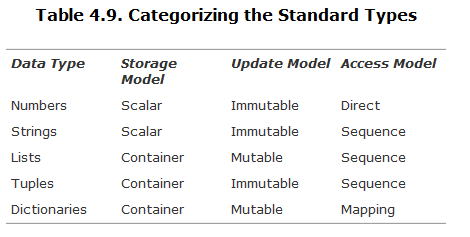

# 本章大纲
介绍Python对象、最常用的标准类型、标准运算符、内建函数、标准类型的分类方式（三种模型）、Python目前不支持的类型

# 知识点
## 4.1 Python对象的三个特性
- 身份：对象的唯一标识，是对象的内存地址，可以通过`id()`获取，只读
- 类型：通过`type()`查看对象的类型，注意返回的是对象而不是简单的字符串，只读
- 值：对象的数据，可读可写

## 4.2 基本数据类型
数字、整型、布尔型、长整型、浮点型、复数型、字符串、列表、元组、字典

## 4.3 对象类型
**对象的类型本身也是对象**，对象类型的类型都是 `type`（类似Java里的`Object`），它是所有Python类型的根和所有Python标准类的默认元类（metaclass）。
Python2.2 统一了类型和类。

## 4.4 None
- None是Python的`null对象`
- None不支持任何运算，也没有任何内建方法
- None类型和Java的void类型相似，None类型的值和Java的null值相似

## 4.5 布尔值测试
所有标准对象均可用于布尔测试，同类型的对象之间可以比较大小。

**布尔值为False的情况：**

  - 空对象
  - 值为零的任何数字
  - Null对象None

**测试两个变量是否指向同一个对象**： `is` 和 `is not`，`a is b `等价于 `id(a) == id(b)`

**不可变对象**：**整数对象**和**字符串对象**，Python会缓存**[-5, 256]**的整数对象和比较小的字符串对象。

not 运算符拥有最高优先级，只比所有比较运算符低一级。 and 和 or 运算符则相应的再低一级。

## 4.6 标准类型内建函数
- `cmp(obj1, obj2)`： 比较 obj1 和 obj2, 根据比较结果返回整数 i:
 - i < 0 if obj1 < obj2
 - i > 0 if obj1 > obj2
 - i == 0 if obj1 == obj2
- `repr(obj)` 或 `` `obj` `` ：返回一个对象的字符串表示（不鼓励使用 ``）
- `str(obj)`： 返回对象适合可读性好的字符串表示
- `type(obj)`：得到一个对象的类型，并返回相应的 type 对象

## 4.7 repr(obj) 和 str(obj)
- `repr()`函数得到的字符串可以用来重新获得该对象（通过求值运算 `eval()`）, 通常情况下 `obj == eval(repr(obj))` 这个等式是成立的。
- `str()` 用于生成一个对象的可读性好的字符串表示，它的返回结果通常无法用于`eval()`求值， 但很适合用于 print 语句输出。
- `repr() `输出对 Python 比较友好， 而 `str()`的输出对人比较友好。

## 4.8 isinstance(obj, type)：判断对象类型
`if isinstance(7, int)` 比 `if type(7) is types.IntType` 简洁

**优化**：通过使用 from-import，可以减少一次查询：`from types import IntType`（为了得到整数的对象类型，解释器会先查找 types 这个模块的名字，然后在该模块的字典中查找 IntType。）

## 4.9 类型工厂函数
- int(), long(), float(), complex()
- str(), unicode(), basestring()
- list(), tuple(), dict()
- type()

## 4.10 三种模型
三种不同的模型对基本类型进行分类，每种模型都表示这些类型之间的相互关系。

1. 存储模型
 - 标量/原子类型：数值（所有的数值类型），字符串（全部是文字）
 - 容器类型：列表、元组、字典

2. 更新模型
 - 可变类型：列表、字典
 - 不可变类型：数字、字符串、元组

3. 访问模型（区分数据类型的主要模型）
 - 直接访问：数字
 - 顺序访问：字符串、列表、元组
 - 映射访问：字典

标准类型分类：


## 4.11 不支持的类型
+ **char、byte**：使用长度为1的字符串表示字符或8比特整数
+ **int vs short vs long**：Python的整数实现等同于C语言的长整数，若数值超出整型的表达范围，Python会自动的返回一个长整数而不会报错。
+ **float vs double**：Python的浮点类型实际上是C语言的双精度浮点类型，不支持单精度浮点数（高精度计算可用`Decimal`）

------------

# 练习
**4-1. Python 对象。与所有 Python 对象有关的三个属性是什么？请简单的描述一下。**

- 身份：对象的唯一标识，是对象的内存地址
- 类型：通过`type()`查看对象的类型
- 值：对象的数据

**4-2. 类型。不可更改（immutable）指的是什么？Python 的哪些类型是可更改的 （mutable），哪些不是？**

immutable：对象创建成功之后，其值不可以被更新。

 - 可变类型：列表、字典
 - 不可变类型：数字、字符串、元组

**4-3. 类型。哪些 Python 类型是按照顺序访问的，它们和映射类型的不同是什么？**
顺序访问：字符串、列表、元组。
顺序访问的索引使用有序的数字偏移量取值，而映射类型的元素是无序存放的，通过一个唯一的 key 来访问。

**4-4. type()。内建函数 type()做什么？type()返回的对象是什么？**
type()用于获取对象的类型，返回的对象是对应的type对象

**4-5. str() 和 repr()。内建函数 str()与 repr()之间的不同是什么？哪一个等价于反引号运算符？**
参照知识点的【repr(obj) 和 str(obj)】
`repr(obj)` 等价于 `` `obj` ``

**4-6. 对象相等。 您认为 type(a) == type(b)和 type(a) is type(b)之间的不同是什么？ 为什么会选择后者？函数 isinstance()与这有什么关系？**

1. `==`判断对象的值是否相等，`is`判断两个对象是否相同（同一内存地址）。
2. 选择`type(a) is type(b)`是因为，我们需要判断的是对象是否为同一个类型对象。
3. `isinstance()`等同于`type(a) is type(b)`，简化了语法。

**4-7. 内建函数 dir()。在第二章的几个练习中，我们用内建函数 dir()做了几个实验， 它接受一个对象，然后给出相应的属性。请对 types 模块做相同的实验。记下您熟悉的类型， 包括您对这些类型的认识，然后记下你还不熟悉的类型。在学习 Python 的过程中，你要逐步将 “不熟悉”的类型变得“熟悉”起来。**
```python
import types
dir(types)
```
> ['BooleanType', 'BufferType', 'BuiltinFunctionType', 'BuiltinMethodType', 'ClassType', 'CodeType', 'ComplexType', 'DictProxyType', 'DictType', 'DictionaryType', 'EllipsisType', 'FileType', 'FloatType', 'FrameType', 'FunctionType', 'GeneratorType', 'GetSetDescriptorType', 'InstanceType', 'IntType', 'LambdaType', 'ListType', 'LongType', 'MemberDescriptorType', 'MethodType', 'ModuleType', 'NoneType', 'NotImplementedType', 'ObjectType', 'SliceType', 'StringType', 'StringTypes', 'TracebackType', 'TupleType', 'TypeType', 'UnboundMethodType', 'UnicodeType', 'XRangeType']

**4-8. 列表和元组。列表和元组的相同点是什么？不同点是什么？**
列表和元组都是容器存储类型，按顺序进行数据的存储和访问，不同的是列表是可变的，而元组不可变。

**4-9. 练习，给定以下赋值：**
```python
a = 10
b = 10
c = 100
d = 100
e = 10.0
f = 10.0
```
**请问下面各表达式的输出是什么？为什么？**

- (a) a is b
- (b) c is d
- (c) e is f

**Answer:**

- (a) True
- (b) True
- (c) False

原因：Python会缓存[-5, 256]的整数对象，而不会缓存可变类型float的对象。

**注意**：如果使用以下方式赋值，`e is f`的结果是`True`！
```python
a = 10; b = 10; c = 100; d = 100; e = 10.0; f = 10.0
```