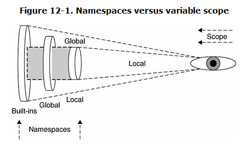

# 本章大纲
本章介绍 Python 模块和如何把数据从模块中导入到编程环境中。**模块是用来组织 Python 代码的方法，而包则是用来组织模块的。**

# 知识点
## 12.1 什么是模块
自我包含并且有组织的代码片断就是模块( module )，模块是按照逻辑来组织 Python 代码。

## 12.2 模块和文件
文件是在物理层上组织模块的方法。
一个文件被看作是一个独立模块, 一个模块也可以被看作是一个文件。

### 12.2.2 搜索路径和路径搜索
**路径搜索**：查找某个文件的操作。
**搜索路径**：去查找一组目录。（导入模块错误就是搜索路径下不存在该模块）

`sys.path`：查看当前的搜索路径。
`sys.modules`：当前导入了哪些模块和它们来自什么地方。

## 12.3 命名空间
*命名空间 是标识符（变量名）到对象的映射。*

**Python 解释器加载 命名空间 的顺序：**

1. 先加载内建命名空间`__builtins__`；
2. 随后加载执行模块的全局命名空间，它在模块开始执行后变为活动命名空间；

--------------------

**`__builtins__` 和 `__builtin__` 的区别：**

 -  `__builtins__` 模块包含内建函数，异常以及其他属性。 
 -  在标准 Python 执行环境下, `__builtins__` 包含 `__builtin__` 的所有name。

### 12.3.1 命名空间与变量作用域比较
如果在执行期间调用了一个函数，那么将创建出第三个命名空间， 即 **局部命名空间**。 


### 12.3.2 变量查找顺序
局部命名空间 → 全局命名空间 → 内建命名空间

### 12.3.3 无限制的命名空间
随时都可以给函数添加任何属性。

## 12.4 导入模块
### 12.4.1 模块导入顺序
- Python 标准库模块
- Python 第三方模块
- 应用程序自定义模块

### 12.4.2 from-import 语句
使用`from module import name1[, name2[,... nameN]]`导入指定的模块属性。

### 12.4.3 多行导入
不提倡使用 `from Tkinter import *` 语句

### 12.4.4 扩展的 import 语句(`as`)
``` python
import Tkinter as tk
from cgi import FieldStorage as form
```

## 12.5 模块导入的特性
### 12.5.1 载入时执行模块

- 加载模块会导致这个模块被"执行"，也就是被导入模块的顶层代码（包括设定全局变量以及类和函数的声明）将直接被执行。 
- **尽可能把代码封装到函数中，只把函数和模块定义放入模块的顶层是良好的模块编程习惯。**

### 12.5.2 导入(import )和加载(load)
- 一个模块只被加载一次, 无论它被导入多少次（防止多重导入时代码被多次执行）。
- 加载只在第一次导入模块时发生。

### 12.5.3 `from module import *`的使用场合
- 目标模块中的属性非常多, 反复键入模块名很不方便。（如：Tkinter、NumPy、socket）
- 在交互解释器下，为了减少输入模块名的次数。

### 12.5.4 被导入到导入者作用域的名字
只从模块导入名字的副作用是那些名字会成为局部命名空间的一部分。

### 12.5.5 关于 `__future__`
体验Python新特性：`from __future__ import new_feature`

### 12.5.6 警告框架
警告框架的两个组件：

- **warnings 模块**：是一些警告异常类的集合。 `Warning` 直接从 `Exception` 继承，是所有警告（`UserWarning`、`DeprecationWarning`、`SyntaxWarning`、 `RuntimeWarning`）的基类。
- **警告过滤器**：收集关于警告的信息(行号、 警告原因等)，控制是否忽略警告、是否显示自定义的格式、或者转换为错误(生成一个异常)。

### 12.5.7 从 ZIP 文件中导入模块
- 如果搜索路径中存在一个包含 Python 模块(`.py`、`.pyc,`、 `.pyo` 文件)的 `.zip` 文件，导入时会把 ZIP 文件当作目录处理，在文件中搜索模块。
- 如果要导入的 ZIP 文件只包含 `.py` 文件, 那么 Python 不会为其添加对应的 `.pyc` 文件（一个 ZIP 归档没有匹配的 `.pyc` 文件时， 导入速度会相对慢一点）。

## 12.6 模块内建函数
### 12.6.1 `__import__()`

```python
# __import__(module_name[, globals[, locals[, fromlist]]])
sys = __import__('sys')
```

### 12.6.2 `globals()` 和 `locals()`
-  内建函数`globals()` 和 `locals()`以字典形式返回调用者的全局命名空间和局部命名空间。
- 在全局命名空间下，`globals()` 和 `locals()`返回相同的字典，因为此时的局部命名空间就是全局空间。

### 12.6.3 `reload()`
*reload() 内建函数：重新导入一个已经导入过的模块。*

**`reload()`使用要求：**

- 模块必须是全部导入(不是使用 `from-import`)，而且它已被成功导入。
- 参数是模块自身而不是模块名字符串。
```python
import sys
reload(sys)
```

## 12.7 包
*包是一个有层次的文件目录结构，定义了一个由模块和子包组成的 Python 应用程序执行环境。*

### 12.7.1 目录结构
- 导入包中的模块：`from package.module import sub_module`
- 模块下的`__init__.py` 文件，用于初始化模块。

### 12.7.2  from-import all

包支持 from-import all 语句：`from package.module import *`
【`__init__.py` 中的 `__all__` 变量包含执行该语句时应该导入的模块名字符串列表。】

### 12.7.3 绝对导入
所有的导入都被认为是绝对的，即这些被导入的模块必须通过Python路径(`sys.path`或是`PYTHONPATH`)来访问。

### 12.7.4 相对导入
```python
from Phone.Mobile.Analog import dial # 绝对导入
from .Analog import dial # 相对导入
from ..Fax import G3.dial # 相对导入
```

## 12.8 模块的其他特性
### 12.8.1 自动载入的模块
`sys.modules` 变量包含当前载入到解释器的模块组成的字典(key为模块名，value为模块路径)

### 12.8.2 阻止属性导入
如果不想让某个模块属性被 `from module import *` 导入 ，可以在不想导入的属性名称加上一个下划线` _ `。 

### 12.8.3 不区分大小的导入
指定 `PYTHONCASEOK` 环境变量，以不区分大小写地导入模块。

### 12.8.4 源代码编码
Python默认的编码格式是ASCII，在模块头部可以指定编码格式。
```python
#!/usr/bin/env python
# -*- coding: UTF-8 -*-
```

### 12.8.5 循环导入
`omh4cli.py`代码：
```python
from cli4vof import cli4vof

# command line interface utility function
def cli_util():
    pass

# overly massive handlers for the command line interface
def omh4cli():
    cli4vof()

omh4cli()
```
`cli4vof.py`代码：

```python
# command-line interface for a very outstanding feature
def cli4vof():
    import omh4cli
    omh4cli.cli_util()
```
执行命令：`python omh4cli.py`，不会因为循环导入模块而运行失败。

### 12.8.5 模块执行的方式
- 通过命令行或 shell：`python hello.py`
- 通过内建函数`execfile()`：`execfile('C:/hello.py')`
- 通过模块导入：`import hello`
- 通过解释器的 -m 选项：`python -m SimpleHTTPServer`

## 12.9 相关模块
- `imp`：这个模块提供了一些底层的导入者功能。
- `modulefinder`：该模块允许你查找 Python 脚本所使用的所有模块。
- `pkgutil`：该模块提供了多种把 Python 包打包为一个"包"文件(`*.pkg`)分发的方法。 
- `site`：和 `*.pth` 文件配合使用, 指定包加入 Python 路径的顺序。
- `zipimport` ：使用该模块导入 ZIP 归档文件中的模块。
- `distutils`：该模块提供了对建立、 安装、分发 Python 模块和包的支持。

# 练习
**12–1. 路径搜索和搜索路径。 路径搜索和搜索路径之间有什么不同?**

参考：12.2.2 搜索路径和路径搜索

**12–2. 导入属性。 假设你的模块 mymodule 里有一个 foo() 函数。**

**(a)** 把这个函数导入到你的命名空间有哪两种方法?

- `from mymodule import foo`
- `import mymodule`

**(b)** 这两种方法导入后的命名空间有什么不同?

第一种方式导入后的命名空间是局部命名空间（可直接使用`foo()`），第二种导入后的命名空间是全局命名空间（通过指定模块名才能使用：`mymodule.foo()`）

**12–3. 导入. "import module" 和 "fromn module import *" 有什么不同?**
`fromn module import *`导入后的命名空间是局部命名空间，可以直接使用module 模块的所有属性。

**12–4. 命名空间和变量作用域。命名空间和变量作用域有什么不同?**

命名空间（Namespaces）是名称（标识符）到对象的映射。所有局部空间的名称都在局部作用范围内。局部作用范围以外的的所有名称都在全局作用范围内。 局部命名空间和作用域会随函数调用不断变化，全局命名空间不变。

**12–5. 使用 `__import__()`.**

**(a)** 使用 `__import__()` 把一个模块导入到你的命名空间。 你最后使用了什么样的语法?

`sys = __import__('sys')`

**(b)** 和上边相同，使用 `__import__()` 从指定模块导入特定的名字。
`__import__('os',globals(),locals(),['path','pip'])`

**12–6. 扩展导入。创建一个 importAs() 函数. 这个函数可以把一个模块导入到你的命名空间, 但使用你指定的名字, 而不是原始名字。 例如, 调用wname=importAs('mymodule') 会导入mymodule , 但模块和它的所有元素都通过新名称 newname 或 newname.attr 访问。 这是 Python2.0 引入的扩展导入实现的功能。**

```python
def importAs(module_name):
    return __import__(module_name)

sys = importAs('sys')
print sys.path
```

**12–7. 导入钩子。 研究 PEP 302 的导入钩子机制. 实现你自己的导入机制, 允许编码你的模块(encryption, bzip2, rot13, 等), 这样解释器会自动解码它们并正确导入。你可以参看 zip 文件导入的实现 (参阅 第 12.5.7 节)。**

*略。*


